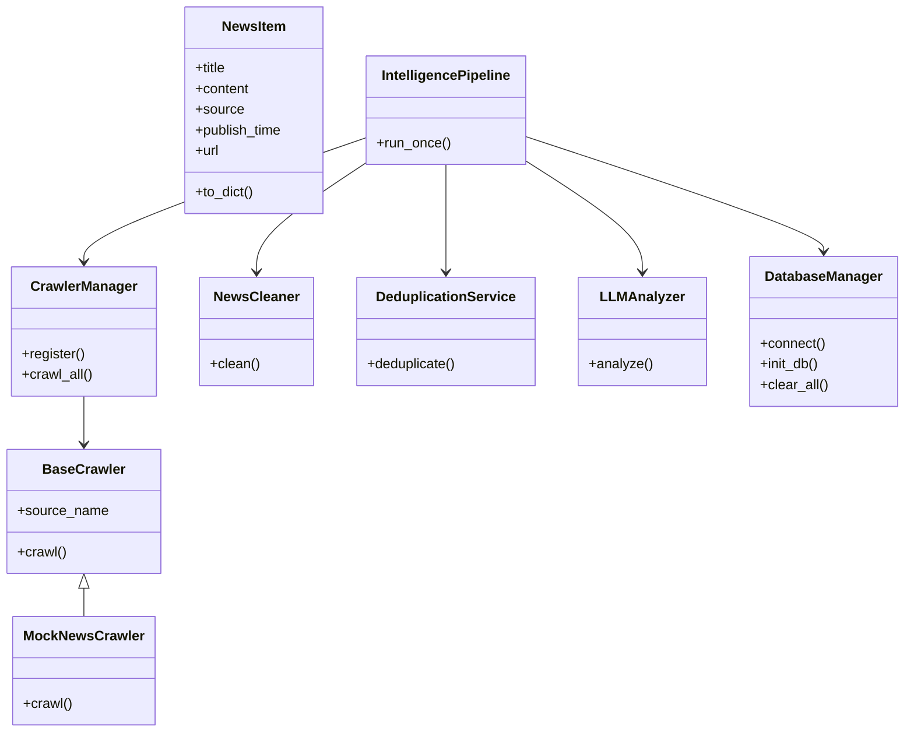

```mermaid
classDiagram
    class NewsItem {
        +title
        +content
        +source
        +publish_time
        +url
        +to_dict()
    }

    class BaseCrawler {
        +source_name
        +crawl()
    }

    class MockNewsCrawler {
        +crawl()
    }

    class CrawlerManager {
        +register()
        +crawl_all()
    }

    class NewsCleaner {
        +clean()
    }

    class DeduplicationService {
        +deduplicate()
    }

    class LLMAnalyzer {
        +analyze()
    }

    class DatabaseManager {
        +connect()
        +init_db()
        +clear_all()
    }

    class IntelligencePipeline {
        +run_once()
    }

    BaseCrawler <|-- MockNewsCrawler
    CrawlerManager --> BaseCrawler
    IntelligencePipeline --> CrawlerManager
    IntelligencePipeline --> NewsCleaner
    IntelligencePipeline --> DeduplicationService
    IntelligencePipeline --> LLMAnalyzer
    IntelligencePipeline --> DatabaseManager
```
