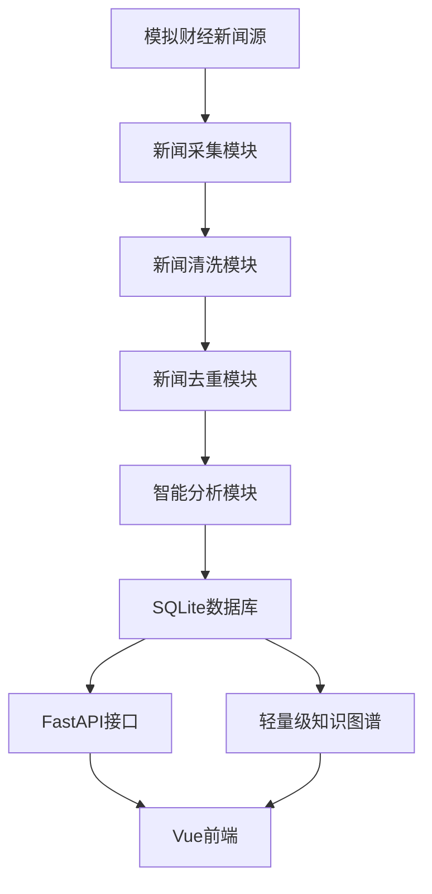

```mermaid
flowchart TD
    A[模拟财经新闻源] --> B[新闻采集模块]
    B --> C[新闻清洗模块]
    C --> D[新闻去重模块]
    D --> E[智能分析模块]
    E --> F[SQLite数据库]
    F --> G[FastAPI接口]
    G --> H[Vue前端]
    F --> I[轻量级知识图谱]
    I --> H
```
