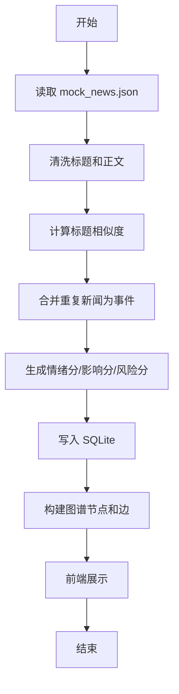

```mermaid
flowchart TD
    A[开始] --> B[读取 mock_news.json]
    B --> C[清洗标题和正文]
    C --> D[计算标题相似度]
    D --> E[合并重复新闻为事件]
    E --> F[生成情绪分/影响分/风险分]
    F --> G[写入 SQLite]
    G --> H[构建图谱节点和边]
    H --> I[前端展示]
    I --> J[结束]
```
